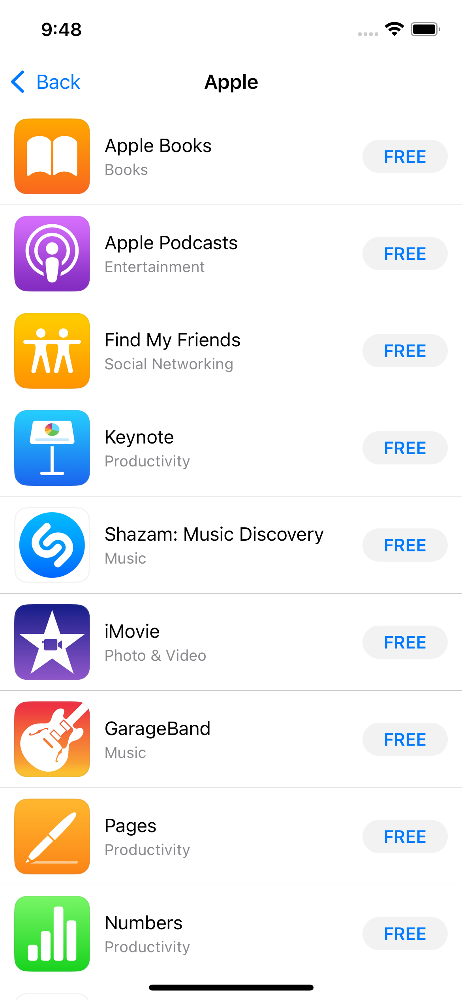
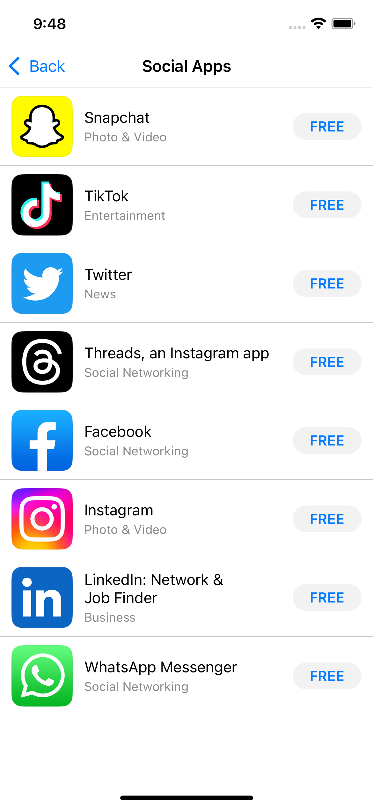
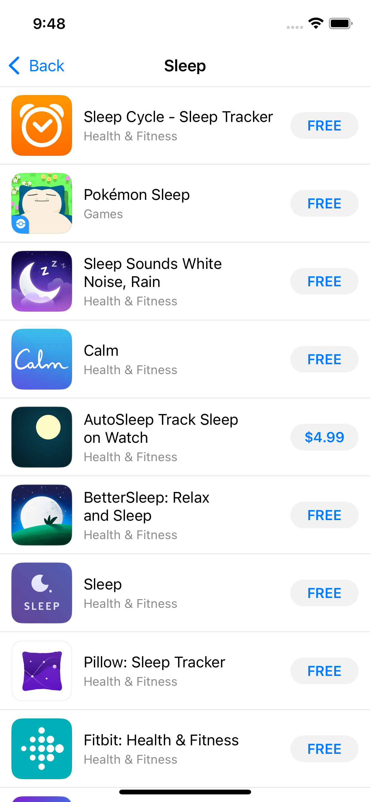

# DAAppsViewController

`DAAppsViewController` is a simple way of displaying apps from the App Store in a similar UI/UX. The user is able to view each app's App Store page by launching an instance of `SKStoreProductViewController`. Particularly useful for showing an app developer's other apps.

For SwiftUI, you should use [AppsView](https://github.com/danielamitay/AppsView)

| By ArtistId | By List of AppIds | By Search Term |
|---|---|---|
|  |  |  |

## Installation

Requires iOS 12.0+

#### Via CocoaPods

- Add to your Podfile:
```ruby
pod 'DAAppsViewController'
```
- `@import DAAppsViewController;`

#### Manually

- Copy over the `DAAppsViewController` folder to your project folder.
- Add the **StoreKit** framework to your project.
- `#import "DAAppsViewController.h"`

## Usage

Example project included (DAAppsViewControllerExample)

#### Displaying apps by a specific developer (useful for "Our other apps")

```objective-c
DAAppsViewController *appsViewController = [[DAAppsViewController alloc] init];
[appsViewController loadAppsWithArtistId:356087517 completionBlock:nil];
[self.navigationController pushViewController:appsViewController animated:YES];
```

#### Displaying a predetermined set of apps

By **appId**:
```objective-c
NSArray *appsArray = @[@575647534,@498151501,@482453112,@582790430,@543421080];
DAAppsViewController *appsViewController = [[DAAppsViewController alloc] init];
appsViewController.pageTitle = @"Apps by XXX"; // Optional
[appsViewController loadAppsWithAppIds:appsArray completionBlock:nil];
[self.navigationController pushViewController:appsViewController animated:YES];
```

By **bundleId**:
```objective-c
NSArray *bundlesArray = @[@"com.flexibits.fantastical.iphone",@"com.samvermette.Transit",@"com.tripsyapp.tripsy",@"com.seatgeek.SeatGeek",@"com.bumptechnologies.flock.Release"];
DAAppsViewController *appsViewController = [[DAAppsViewController alloc] init];
[appsViewController loadAppsWithBundleIds:bundlesArray completionBlock:nil];
[self.navigationController pushViewController:appsViewController animated:YES];
```

#### Displaying apps for a specific App Store search term

```objective-c
DAAppsViewController *appsViewController = [[DAAppsViewController alloc] init];
[appsViewController loadAppsWithSearchTerm:@"Radio" completionBlock:nil];
[self.navigationController pushViewController:appsViewController animated:YES];
```
